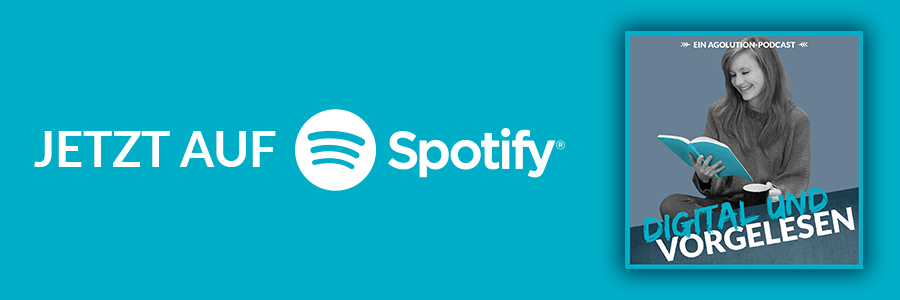

<link href="https://fonts.googleapis.com/css?family=Open+Sans:300,400,600,700" rel="stylesheet">

# Tobias Sundermann

 

##  AGOLUTION 

&nbsp;&nbsp;&nbsp;&nbsp;&nbsp;&nbsp; Marketing  
&nbsp;&nbsp;&nbsp;&nbsp;&nbsp;&nbsp;&nbsp;&nbsp;&nbsp;&nbsp;&nbsp;&nbsp; - Webdesign  
&nbsp;&nbsp;&nbsp;&nbsp;&nbsp;&nbsp;&nbsp;&nbsp;&nbsp;&nbsp;&nbsp;&nbsp; - Grafikdesign  
&nbsp;&nbsp;&nbsp;&nbsp;&nbsp;&nbsp;&nbsp;&nbsp;&nbsp;&nbsp;&nbsp;&nbsp; - Podcast

 

## 📜 Erfahrung
| | |
| - | - |
|       |    |
|   |  |
|  |  |
|   |  |

 

## 🎙 Der AGOLUTION Podcast!

